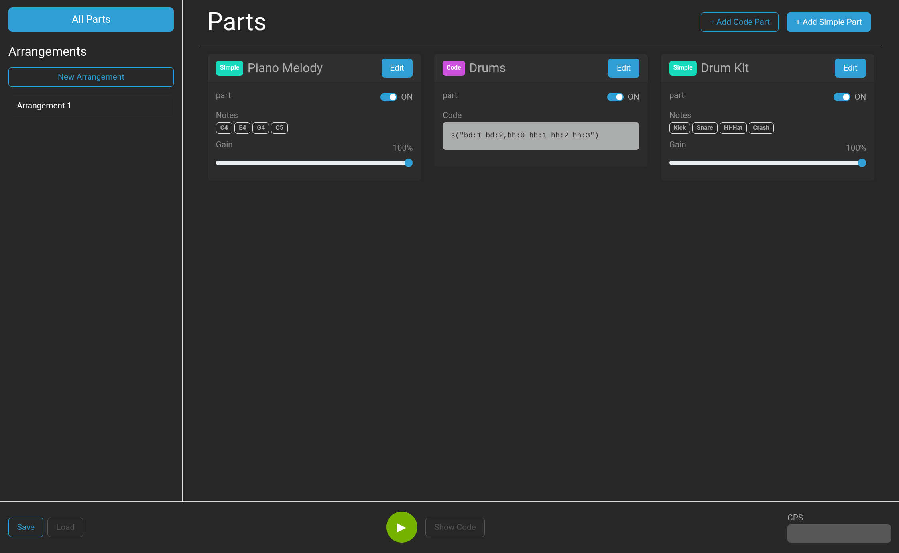
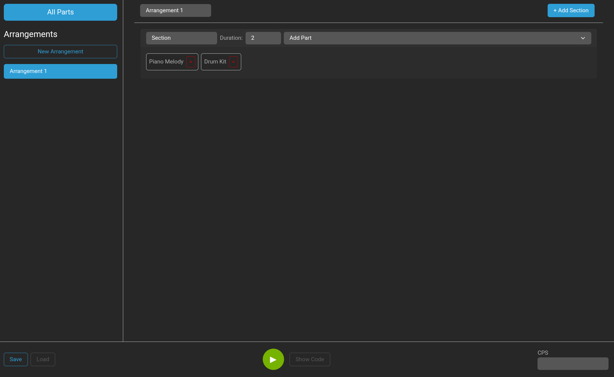
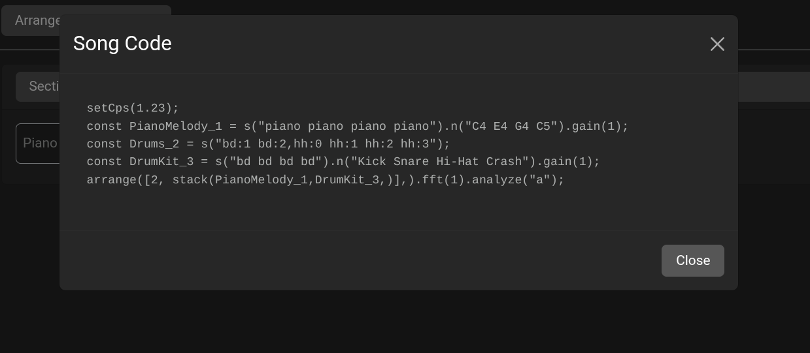
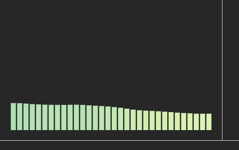

# Strudel Reactor 🥐⚛️

🎶 A music production tool for writing jams in [Strudel](https://strudel.cc) 🎶

🔊 Check it out at https://reactor.sirsegv.moe/ 🔊

## User Guide 🎛️

Strudel Reactor works with two main concepts, Parts and Arrangements. A Part is typically a single instrument playing a repeated rhytm or melody, a building block of your song that you can turn on and off to create variation in your music. By default Strudel Reactor shows all of your parts in the Parts view.

Parts can either be simple or code, with simple parts being a single instrument playing a single rythm. This is enough to create some simple beats (hence the name) but to really get grooving you'll need to use a code part. These let you write your own Strudel code to be used to make all kinds of sounds.

If you're new to Strudel, take a look at the getting started guide https://strudel.cc/workshop/getting-started/

Once you've made some nice sounding parts, you may be getting tired of toggling them on and off manually and want to make them play at different times to really get the song going.

This is where Arrangements come in. You can create a new Arrangement by clicking the appropriately named 'New Arragement' button in the left sidebar, which will open your newly created Arrangement.

Arrangements let you organise your parts into a structure through Sections. To create a Section, use the button at the top right of the Arrangements view, then use the Add Part dropdown to select parts to add to your section. You can also specify the duration each section will play for in the Duration box, and if you wish to organise your sections you may give each one a name by editing the text box to the left of the duration.

If you at any point want to see the Strudel code for your lovely composition either out of curiosity or to use with another Strudel editor, use the `Show Code` button next to the music controls to show the your song in Strudel form.

NOTE: This will be different depending on the view you have open, if you want to see the code to play your arrangement, make sure you have that arrangement open!

Strudel Reactor saves your song to your browsers local storage to ensure you don't lose your work as you go, but if you'd like to save your song as a file you can send to your friends or just as a backup you can use the `Save` and `Load` buttons on the bottom left of the application to export your composition as a JSON file.

To help you feel the groove of your song theres a visualiser below the arrangements list that pulses to the rythm of your music!

## Developer Things 🤓

If you just want to see what all the fuss is about you can check out this project at https://reactor.sirsegv.moe/ no programming knowledge required. However if you're one of those techy types and want to run it from source, read on.

To run this project from its source code, first clone this repository with `git clone https://github.com/squidink7/strudel_reactor.git` then `cd strudel_reactor`.

Once you've cloned the repo use `npm i` to install the dependencies

You can use the following commands to build and run the application:

### `npm start`

Runs the app in the development mode.
Open [http://localhost:3000](http://localhost:3000) to view it in your browser.

### `npm run build`

Builds the app for production to the `build` folder.

### Video Guide

A demo video is included in the assignment submission.

The song used in the video was sourced from https://github.com/eefano/strudel-songs-collection/blob/main/shanghai.js